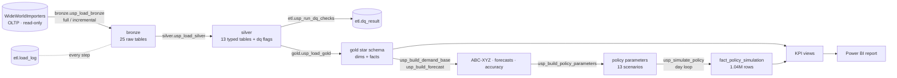
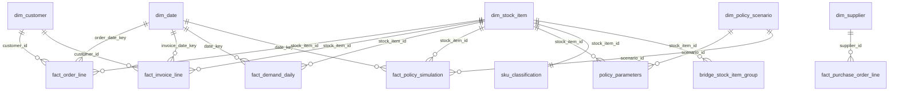

# Architecture & data model

## Data flow

```mermaid
flowchart LR
    SRC[(WideWorldImporters<br/>OLTP · read-only)] -->|bronze.usp_load_bronze<br/>full / incremental| B[bronze<br/>25 raw tables]
    B -->|silver.usp_load_silver| S[silver<br/>13 typed tables + dq flags]
    S -->|etl.usp_run_dq_checks| DQ[(etl.dq_result)]
    S -->|gold.usp_load_gold| G[gold star schema<br/>dims + facts]
    G -->|usp_build_demand_base<br/>usp_build_forecast| F[ABC-XYZ · forecasts · accuracy]
    F -->|usp_build_policy_parameters| P[policy parameters<br/>13 scenarios]
    P -->|usp_simulate_policy<br/>day loop| SIM[fact_policy_simulation<br/>1.04M rows]
    G --> V[KPI views]
    SIM --> V
    V --> PBI[Power BI report]
    LOG[(etl.load_log)] -.every step.- B
```

## Gold star schema (main relationships)

```mermaid
erDiagram
    dim_date ||--o{ fact_order_line : order_date_key
    dim_date ||--o{ fact_invoice_line : invoice_date_key
    dim_date ||--o{ fact_demand_daily : date_key
    dim_date ||--o{ fact_policy_simulation : date_key
    dim_stock_item ||--o{ fact_order_line : stock_item_id
    dim_stock_item ||--o{ fact_invoice_line : stock_item_id
    dim_stock_item ||--o{ fact_demand_daily : stock_item_id
    dim_stock_item ||--o{ fact_policy_simulation : stock_item_id
    dim_stock_item ||--o{ policy_parameters : stock_item_id
    dim_stock_item ||--|| sku_classification : stock_item_id
    dim_stock_item ||--o{ bridge_stock_item_group : stock_item_id
    dim_customer ||--o{ fact_order_line : customer_id
    dim_customer ||--o{ fact_invoice_line : customer_id
    dim_policy_scenario ||--o{ policy_parameters : scenario_id
    dim_policy_scenario ||--o{ fact_policy_simulation : scenario_id
    dim_supplier ||--o{ fact_purchase_order_line : supplier_id
```
